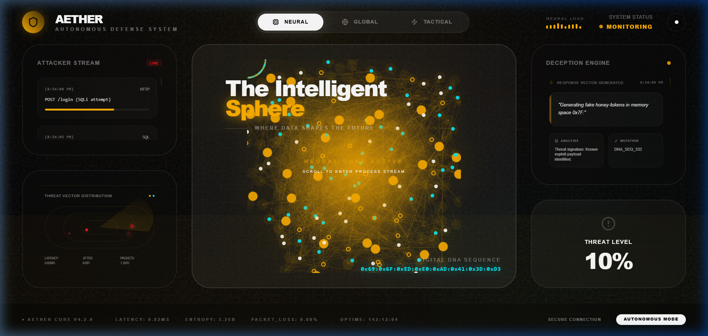
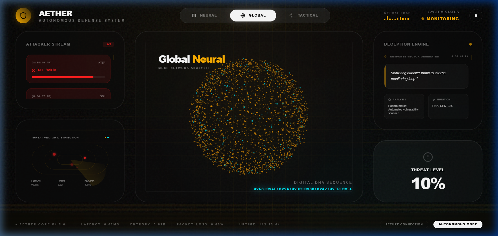
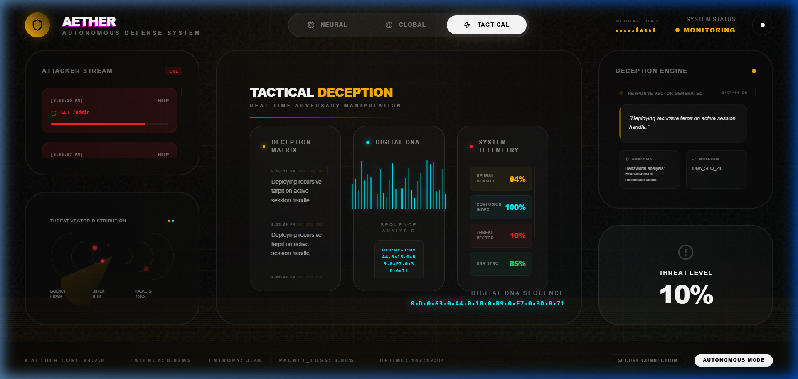

# AETHER Defense System
### Autonomous, Evolving, Tamper-proof Honeypot Ecosystem with Reactive Intelligence

[](https://aetherconcept02.vercel.app/)
[](https://vercel.com/)
[](https://react.dev/)
[](https://deepmind.google/technologies/gemini/)

AETHER is a next-generation "Active Defense" platform that transforms traditional security monitoring into an autonomous, proactive response engine. Using Gemini AI and real-time behavioral analysis, AETHER doesn't just watch threats—it manipulates them.

---

## 🚀 Live Working Demo


*Full system walkthrough showing Neural, Global, and Tactical transitions.*

---

## 🧠 Core Sections

### 1. Neural Core (Active Intelligence)
The heart of AETHER where the **Neural Sphere** processes high-dimensional threat data. It visualizes incoming packet streams and identifies patterns using generative AI.
- **Key Features**: Live Neural Load monitoring, Attacker Stream ingestion, and AI-driven Response Vector generation.



### 2. Global Network (Mesh Analysis)
A macro-level view of the entire mesh network. It monitors threat vector distributions and global latency patterns to identify coordinated multi-vector attacks.
- **Key Features**: Global Neural Mesh visualization, Latency tracking, and Packets-per-second (PPS) analysis.



### 3. Tactical Deception (Adversary Manipulation)
The offensive capability of AETHER. Once a threat is identified, the **Deception Matrix** deploys "honey-tokens" and "recursive tarpits" to trap and study the adversary.
- **Key Features**: Digital DNA sequencing, Deception Matrix deployment, and Real-time adversary manipulation.



---

## 🛠️ Technology Stack

- **Frontend**: React 19, TypeScript, Vite
- **Visualizations**: D3.js (Neural Sphere), Framer Motion (Animations)
- **AI Integration**: Google Gemini 1.5 Pro (via `@google/genai`)
- **Styling**: Vanilla CSS with Modern Glassmorphism
- **Hosting**: Vercel

---

## 🏗️ Technical Architecture

AETHER follows a reactive pipeline:
1. **Ingest**: captures raw attack data from the `AttackerStream`.
2. **Analyze**: Gemini AI interprets attacker intent and technical sophistication.
3. **Response**: The `DeceptionEngine` generates high-entropy noise or tarpits tailored to the threat.
4. **Mutate**: The system "Digital DNA" evolves (via `DNA_SEQ`) to prevent future exploitations.

---

## 📦 Installation & Setup

1. **Clone the repository**:
   ```bash
   git clone https://github.com/gurarpitzz/AETHER-Concept2.git
   cd AETHER-Concept2
   ```

2. **Install dependencies**:
   ```bash
   npm install
   ```

3. **Configure Environment**:
   Create a `.env.local` file:
   ```env
   GEMINI_API_KEY="YOUR_API_KEY"
   ```

4. **Run Locally**:
   ```bash
   npm run dev
   ```

---

## 🛡️ License
Copyright © 2026 AETHER Project. All rights reserved.
Developed as a conceptual framework for Autonomous Defense Systems.
