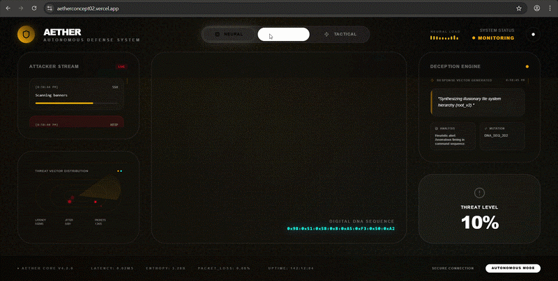
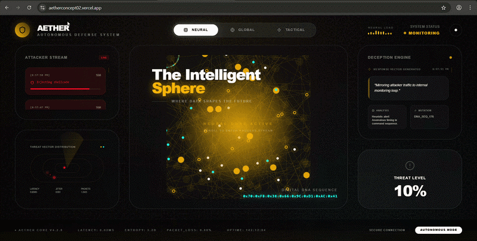
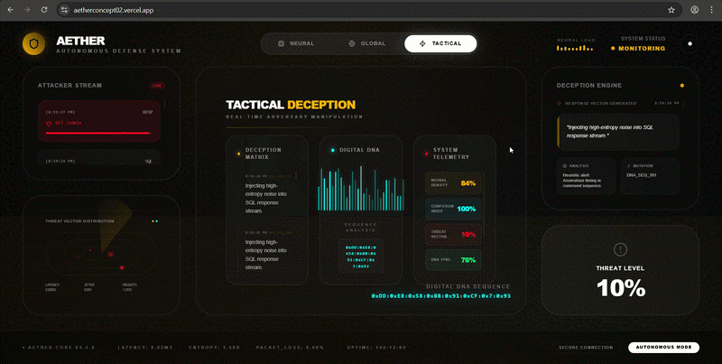

# AETHER Defense System
## Autonomous Evolving Tamper-proof Honeypot Ecosystem with Reactive Intelligence

AETHER is a high-fidelity active defense platform designed for autonomous threat mitigation and adversary manipulation. Combining real-time behavioral analysis with Large Language Model (LLM) reasoning via Google Gemini, the system transitions from passive monitoring to proactive deception.

Link: https://aetherconcept02.vercel.app

---

## System Operational State


*Real-time global mesh network analysis showing threat vector distribution.*

---

## Core Operational Modules

### 1. Neural Interface Layer
The primary intelligence tier of the AETHER ecosystem. It serves as the ingestion point for high-dimensional attack data, utilizing a proprietary Neural Sphere visualization to represent data-shaping protocols.
- **Operational Logic**: Processes incoming `AttackerStream` data through a reactive pipeline.
- **AI Integration**: Leverages Gemini 1.5 Pro for real-time intent analysis and response vector synthesis.



### 2. Tactical Deception Engine
The offensive component of the system, responsible for adversary manipulation through the deployment of autonomous deception matrices.
- **Mitigation Protocols**: Automated deployment of "recursive tarpits" and "honey-tokens" tailored to the specific technical sophistication of the adversary.
- **Adversary DNA**: Real-time sequencing of attacker behavior to enable predictive state mutation.



---

## Technical Specification

### Software Architecture
- **Environment**: Node.js 20+ Runtime
- **Core Framework**: React 19 (TypeScript 5.8)
- **Data Visualization**: D3.js (Spatial Clustering & Force-Directed Graphs)
- **Animation Engine**: Framer Motion (State-aware visual transitions)
- **Intelligence Core**: Google Gemini 1.5 (Reactive Prompt Engineering)

### Infrastructure
- **Build System**: Vite 6.0
- **Primary Deployment**: Vercel Cloud Runtime
- **Repository Management**: GitHub Automated CI/CD

---

## Project Resources

For further analysis and understanding of the AETHER architecture, the following resources are available:

- **Project Dataset**: [AETHER Threat Data Repository](https://drive.google.com/drive/folders/1iVA3zgfd-ek2CnMqKF9n7d7LY18EutMY?usp=sharing)
- **Access Video**: [AETHER System Architecture & Operational Guide](https://drive.google.com/file/d/1uSyJl79Ziea69_98DhLlZRu1aitBSXC_/view?usp=sharing)
- **Project Presentation**: [AETHER Concept PPT](https://drive.google.com/drive/folders/1gm-7JYKgJUWkmJ-GwpVJee_XqMZcr4EA?usp=sharing)

---

## Installation & Deployment

### Local Environment Setup
1. **Clone Repository**:
   ```bash
   git clone https://github.com/gurarpitzz/AETHER-Concept2.git
   ```
2. **Dependency Management**:
   ```bash
   npm install
   ```
3. **Environment Specification**:
   Define `GEMINI_API_KEY` in a local `.env.local` file.
4. **Development Ingress**:
   ```bash
   npm run dev
   ```

---

## Licensing & Governance
This project is developed as a conceptual framework for Autonomous Defense Systems. All rights reserved. 2026 AETHER Project.
